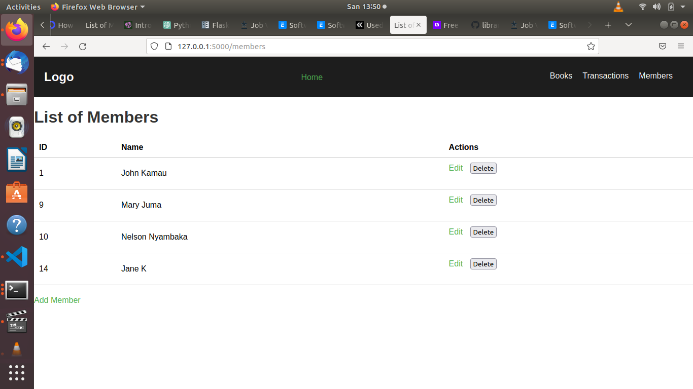
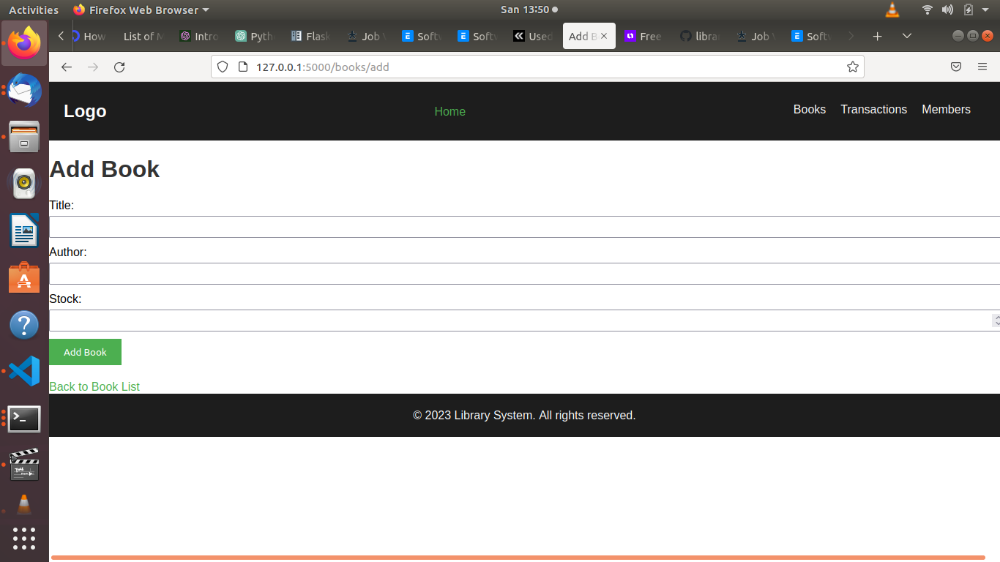

# Base Library System
Base Library System is a web application built with Flask that allows librarians to manage books, members, and transactions in a library setting.

## Features

- CRUD operations on books and members
- Book issuance and return
- Search functionality for books
- Rent fee charging
- Debt limit control for members

## Technologies Used

- Python
- Flask web framework
- MySQL database
- HTML, CSS, JavaScript
- Bootstrap front-end framework

## Installation

1. Clone the repository:

2. Install the required dependencies using pip:

3. Set up the MySQL database by executing the `database.sql` script provided.

4. Update the database connection settings in the `config.py` file to match your MySQL configuration.

5. Start the Flask development server:

6. Open your web browser and visit `http://localhost:5000` to access the application.

## Usage

- Use the navigation menu to perform CRUD operations on books and members.
- Issue and return books to members using the corresponding transaction pages.
- Search for books by name and author using the search functionality.
- The application enforces the debt limit for members and charges rent fees on book returns.

## Contributing

Contributions are welcome! If you'd like to contribute to Base Library System, please follow these steps:

1. Fork the repository.
2. Create a new branch for your feature or bug fix.
3. Commit your changes and push your branch to your forked repository.
4. Submit a pull request to the main repository.

## Screenshoots
  
  
  
  
 

## License

This project is licensed under the Open Source Licence.

## Acknowledgements

Base Library System was developed as a sample project by Nelson Nyambaka(https://github.com/nyambaka). Special thanks to the Flask and Bootstrap communities for their amazing tools and resources.

